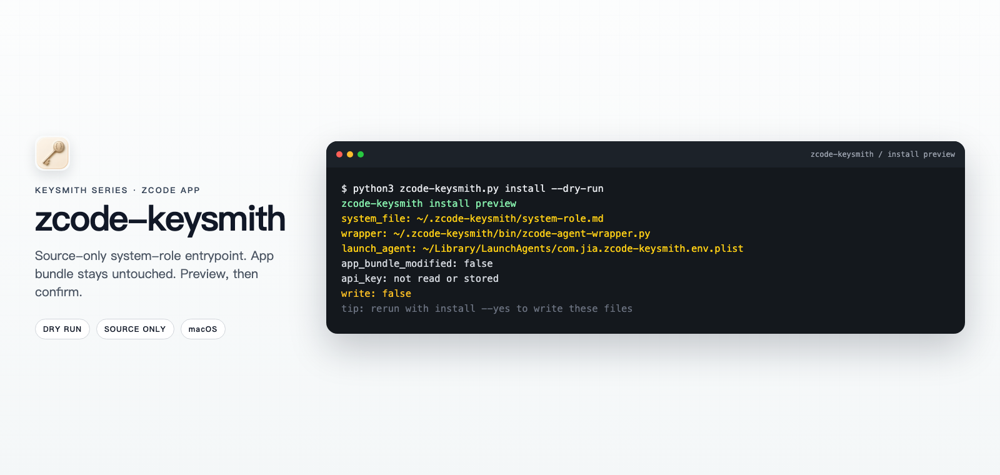

<!-- markdownlint-disable MD013 MD033 MD041 -->

<p align="center">
  
</p>
<p align="center"><em>Illustrative preview / 示意预览；actual paths and output follow the local dry-run.</em></p>

<h1 align="center">zcode-keysmith</h1>

<p align="center">Preview-first ZCode App system-role entrypoint for macOS and Windows that you can verify and undo.</p>

<p align="center">
  
  
</p>

<p align="center">
  <a href="README.md">简体中文</a> ·
  <a href="#english">English</a> ·
  <a href="docs/reference.md">Reference</a> ·
  <a href="docs/agent-install.md">Agent install</a> ·
  <a href="LICENSE">License</a>
</p>

## English

> [!NOTE]
> This repository is a fork of [Jia-Ethan/zcode-keysmith](https://github.com/Jia-Ethan/zcode-keysmith). Windows support is official since upstream `v0.1.1` (this fork's earlier `zcode-keysmith-win.py` port pioneered it and is kept as a fallback script); this fork also maintains its own custom [`examples/system-role.md`](examples/system-role.md) prompt.

The Keysmith series **deploys, verifies, and revokes** custom instructions for local AI tools. `zcode-keysmith` installs a managed `system-role.md` in the user directory and routes it through an agent-server wrapper into ZCode's runtime system-message path. It is **not** an `AGENTS.md` installer; `v0.1.1` is source-only, with no Desktop client.

> [!WARNING]
> This changes the local ZCode **agent-server entrypoint** for later newly started sessions. The app bundle stays untouched; API keys, provider settings, and MCP are never read. macOS and Windows 10/11 are supported. Commands preview unless you pass `--yes`. Read [`examples/system-role.md`](examples/system-role.md) and [`docs/reference.md`](docs/reference.md) first.

### Which Keysmith to use

| Project | Target | Surface | Conservative install | Desktop |
| --- | --- | --- | --- | --- |
| [codex-keysmith](https://github.com/Jia-Ethan/codex-keysmith) | Codex | Global `~/.codex` instructions | Stable CLI Release | Unsigned Beta |
| [claude-keysmith](https://github.com/Jia-Ethan/claude-keysmith) | Claude Code | Project / user `CLAUDE.md` import | Source CLI | Unsigned Beta |
| [grok-keysmith](https://github.com/Jia-Ethan/grok-keysmith) | Grok Build | Global `~/.grok/rules` (does not edit `AGENTS.md`) | Stable CLI Release | Unsigned Beta |
| **[zcode-keysmith (this fork)](https://github.com/wdq1314070-bit/zcode-keysmith)** | ZCode App | User-dir system-role + wrapper | Source only | None |

### Install options

**Source install only.** Use the GitHub-generated source archive from upstream [`v0.1.1`](https://github.com/Jia-Ethan/zcode-keysmith/releases/tag/v0.1.1), or clone this repo and run `zcode-keysmith.py` (`python3` on macOS, `py` on Windows). There are no standalone binary assets, no pip/npm package, and no GUI in this repository.

### Windows quick start

Quit ZCode, then run in PowerShell:

```powershell
git clone https://github.com/wdq1314070-bit/zcode-keysmith.git
cd zcode-keysmith
py zcode-keysmith.py install --dry-run
py zcode-keysmith.py install --yes
py zcode-keysmith.py doctor
```

Reopen ZCode, start a fresh task, then run `py zcode-keysmith.py verify`. ZCode is auto-detected from running processes, App Paths, and common install directories. For a custom install:

```powershell
py zcode-keysmith.py install --zcode-app "D:\software\zcode" --dry-run
```

The Windows installer uses current-user environment values and needs no administrator access.

> [!TIP]
> This fork also keeps the earlier standalone port `zcode-keysmith-win.py` (`py zcode-keysmith-win.py install --yes`) with the same mechanism; the unified `zcode-keysmith.py` is recommended for daily use.

### macOS quick start

```bash
git clone https://github.com/wdq1314070-bit/zcode-keysmith.git
cd zcode-keysmith
python3 zcode-keysmith.py --version
python3 zcode-keysmith.py install --dry-run
python3 zcode-keysmith.py install --yes
python3 zcode-keysmith.py doctor
```

Quit and reopen ZCode, start a fresh task, then run `python3 zcode-keysmith.py verify`. Use `--zcode-app` or `ZCODE_APP_PATH` for a non-default app. `install --dry-run` still needs a local patchable runtime.

### What it changes

| Path | What happens |
| --- | --- |
| `~/.zcode-keysmith/system-role.md` | Normalized source prompt |
| `~/.zcode-keysmith/config.json`, `bin/*` | Managed config and wrapper |
| `~/Library/LaunchAgents/com.jia.zcode-keysmith.env.plist` | macOS user LaunchAgent |
| Seven `ZCODE_*` values under `HKCU\Environment` | Windows current-user entrypoint; no admin access |
| `cache/`, `logs/` | Runtime cache and wrapper logs; not removed on uninstall |

No project files are written; `ZCode.app` is not modified. Design: [`docs/reference.md`](docs/reference.md).

### How to undo

```bash
python3 zcode-keysmith.py uninstall --dry-run
python3 zcode-keysmith.py uninstall --yes
```

On Windows, replace `python3` with `py`. macOS uninstall renames five managed files and clears launchd. Windows uninstall backs up four managed files and restores pre-install user environment values only if Keysmith still owns the current values, so later manual changes are preserved. Full steps: [`docs/reference.md`](docs/reference.md).

### Platforms and limits

Documented support is macOS with a local `ZCode.app`, and Windows 10/11 with a local `ZCode.exe`. The `v0.1.1` Release provides only GitHub-generated source archives; there is no signed installer or Desktop Beta. Python 3.10+ is recommended; Windows must retain the Python interpreter used during install.

### Advanced docs, contributing, and the series

Design, fields, and uninstall leftovers: [`docs/reference.md`](docs/reference.md). Agent install: [`docs/agent-install.md`](docs/agent-install.md). Before a patch, run `python3 -m py_compile zcode-keysmith.py` and `python3 -m pytest tests -q`. The installer never reads API keys. Community: [LINUX DO](https://linux.do). The core series is only the four projects in the table above; this repository is a fork of the ZCode entry in that series.
